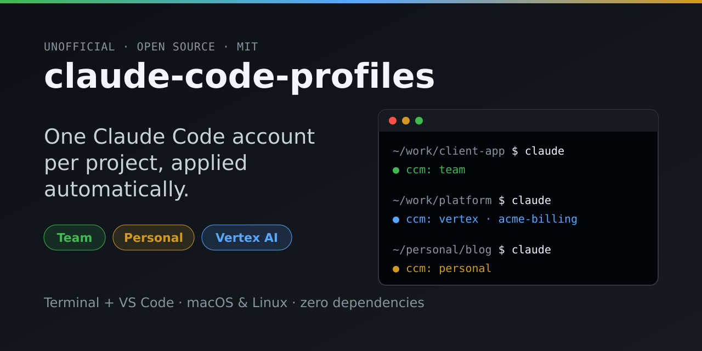

<p align="center">
  
</p>

# claude-code-profiles

[](https://github.com/FrancescoBoschi/claude-code-profiles/actions/workflows/ci.yml)
[](https://github.com/FrancescoBoschi/claude-code-profiles/releases/latest)
[](LICENSE)

**One Claude Code account per project, applied automatically.**

If you use Claude Code with more than one account (a company Team plan, one or more
personal accounts, billing through Google Vertex AI or Amazon Bedrock, a Console API key)
`ccprof` lets you bind each project to
its account once. From then on you just run `claude` as usual, in the terminal or in the
VS Code panel, and it starts with the right account. No logging out, no environment
variables to remember, no risk of billing the wrong project.

```text
~/work/client-app   →  work       (company Team plan)
~/work/platform     →  gcp-prod   (billed to a GCP project via Vertex AI)
~/personal          →  personal   (your own subscription)
~/side-projects     →  side       (a second personal account)
```

> **Unofficial project**, not affiliated with Anthropic. Claude and Claude Code are
> trademarks of Anthropic. ccprof relies on Claude Code mechanisms that work but are not all
> officially documented (see [Known limitations](#known-limitations)).

## Why ccprof

- **Set it once per project.** Bindings live outside your repositories, so nothing ends up in shared commits.
- **As many profiles as you need**, with any name you like: two personal accounts, several GCP projects, a client's Team plan.
- **Every way to pay for Claude Code**: Pro/Max/Team/Enterprise subscriptions, Google Vertex AI, Amazon Bedrock and Anthropic Console API keys.
- **Fail-closed.** In a folder with no profile, `claude` refuses to start instead of silently using the wrong account.
- **Terminal and VS Code.** The official Claude Code panel uses the same profiles, and a status bar shows which one is active.
- **Private by design.** No telemetry, no network calls at runtime, no dependencies beyond bash. Credentials never leave your machine: logins stay where Claude Code, gcloud and aws keep them, and API keys live in your OS keychain, never in a file.

## Contents

- [Requirements](#requirements)
- [Installation](#installation)
- [Setup in 5 minutes](#setup-in-5-minutes)
- [VS Code](#vs-code)
- [Everyday use](#everyday-use)
- [Commands](#commands)
- [How it works](#how-it-works)
- [Existing conversations](#existing-conversations)
- [Troubleshooting](#troubleshooting)
- [Known limitations](#known-limitations)
- [Updating and uninstalling](#updating-and-uninstalling)
- [Development](#development)

## Requirements

- **macOS or Linux** (on Windows: inside WSL). Works with zsh and bash, including the bash 3.2 that ships with macOS.
- **Claude Code** already installed (`claude --version`).
- For Vertex AI profiles: the **Google Cloud SDK** (`gcloud`) and a GCP project with Claude models enabled in Vertex AI.
- For Bedrock profiles: AWS credentials (the **AWS CLI** is recommended) and Claude models enabled in Amazon Bedrock.
- For API key profiles: the macOS Keychain, or `secret-tool` (libsecret) on Linux.
- For the extension: **VS Code** with the official Claude Code extension.

## Installation

### Option A: one command

```bash
curl -fsSL https://raw.githubusercontent.com/FrancescoBoschi/claude-code-profiles/main/install.sh | bash -s -- --with-vscode
```

Installs the CLI and, if the `code` command is available, the VS Code extension too.
Without `--with-vscode` only the CLI is installed.

### Option B: from the Releases page

1. Download `ccprof.tar.gz` from the [latest release](https://github.com/FrancescoBoschi/claude-code-profiles/releases/latest).
2. In a terminal:
   ```bash
   tar xzf ccprof.tar.gz && cd ccprof
   ./install.sh --with-vscode
   ```

### Option C: from source

```bash
git clone https://github.com/FrancescoBoschi/claude-code-profiles.git && cd claude-code-profiles
./install.sh
```

### What the installer does

- copies the files to `~/.local/share/ccprof`;
- creates `~/.config/ccprof/` (profiles and bindings);
- appends a block marked `# >>> ccprof >>>` to the end of `~/.zshrc` / `~/.bashrc`, which puts the ccprof shim first on your PATH.

Then **open a new terminal** and check:

```bash
ccprof doctor
```

The first line should read `✓ the ccprof shim is the first 'claude' on PATH`.

## Setup in 5 minutes

### 1. Create one profile per account

You do this **once**, from any folder. The name is up to you. `--auth` says how the account
authenticates, `--tag` whether it is a work or a personal account (personal ones are
highlighted). Create as many profiles as you need.

```bash
ccprof add work     --auth subscription --tag work        # company Team/Enterprise plan
ccprof add personal --auth subscription --tag personal    # your Pro/Max subscription
ccprof add side     --auth subscription --tag personal    # a second personal account
ccprof add gcp-prod --auth vertex  --project MY-GCP-PROJECT --region global
ccprof add aws-dev  --auth bedrock --region us-east-1 --aws-profile dev
ccprof add console  --auth api-key --tag personal         # asks for the key, stores it in the keychain
```

| `--auth` | Billing | Extra options |
|---|---|---|
| `subscription` (default) | Pro, Max, Team or Enterprise plan, via login | — |
| `vertex` | a Google Cloud project | `--project ID`, `--region R` (default `global`), `--gcloud-config NAME` |
| `bedrock` | an AWS account | `--region R`, `--aws-profile NAME` |
| `api-key` | an Anthropic Console API key | the key is read from the prompt (or stdin) and stored in the OS keychain |

Run `ccprof add <name>` without options to be asked interactively. The pre-0.5 form
`--type team|personal|vertex` still works.

### 2. Log in once per profile

```bash
ccprof login work       # Claude Code opens: log in (type /login if the screen does not appear), then /exit
ccprof login personal
ccprof login side
ccprof login gcp-prod   # for Vertex this runs: gcloud auth application-default login
```

Bedrock profiles use your AWS credentials (`ccprof login` runs `aws sso login` when the
profile has an `--aws-profile`); API key profiles need no login. Each profile keeps its own
credentials, so you never have to log in again.

### 3. Bind your projects

Do this **once per project**, from the project folder:

```bash
cd ~/work/client-app && ccprof bind work
cd ~/work/platform   && ccprof bind gcp-prod
```

`bind` uses the root of the git repository, so running it from a subfolder is fine.

**Shortcut:** bind the folders that contain your projects. The most specific binding
always wins, so you can still make exceptions for single projects:

```bash
ccprof bind work ~/work                 # every project in ~/work, including future ones
ccprof bind personal ~/personal
ccprof bind gcp-prod ~/work/platform    # exception: this one is billed to Vertex
```

### 4. Check

```bash
cd ~/work/client-app
ccprof which        # shows which profile will be used here, and why
claude           # the statusline shows "ccprof: work"; /status shows the account
```

## VS Code

The official Claude Code extension starts its **own** `claude` binary without going
through your PATH: without configuration the panel would use the default account and
ignore ccprof. The fix is the `claudeCode.claudeProcessWrapper` setting, which ccprof supports.

### With the ccprof extension (recommended)

1. Install it with `./install.sh --with-vscode`, or download `ccprof-vscode.vsix` from the
   [Releases page](https://github.com/FrancescoBoschi/claude-code-profiles/releases/latest) and in VS Code choose
   **Extensions → `…` → Install from VSIX…**.
2. Reload VS Code. On first start it offers to configure the Claude Code panel:
   choose **Configure**, then **Reload Window**.

What you get:

- **Status bar** (bottom left): the workspace profile, for example `ccprof: work` or
  `ccprof: gcp-prod · my-project`. It turns **red** when the workspace is not bound and
  **yellow** for personal profiles. The tooltip shows every folder of the workspace. Click it for the menu.
- **Command Palette** (`Cmd/Ctrl+Shift+P` → "ccprof"):
  - *Bind Profile to Workspace*, to the project or to its whole parent folder;
  - *Remove Binding*;
  - *Open Claude Terminal with Profile…*, for a one-off different profile;
  - *Show Profiles and Projects*, *Doctor*;
  - *Configure Claude Code Panel*.

Settings: `ccprof.path` (path to ccprof, if not the default one), `ccprof.highlightPersonal`,
`ccprof.checkClaudeWrapper`.

### Without the ccprof extension

In your **user** settings (`Preferences: Open User Settings (JSON)`) add, with your own
macOS/Linux user name:

```json
"claudeCode.claudeProcessWrapper": "/Users/YOUR-USER-NAME/.local/share/ccprof/shims/claude"
```

then run `Developer: Reload Window`.

## Everyday use

There is nothing to do: open the project and use `claude` or the panel. `--continue` and
`--resume` always find the project's conversations, because the project always uses the
same profile.

- **New project?** If `claude` says `no profile bound to …`, run `ccprof bind <profile>`
  (or use the VS Code status bar). This is on purpose: an error is better than the wrong account.
- **Another account, just once?** `ccprof run <profile>` (accepts the same arguments as `claude`).
- **Move a project to another account?** `ccprof bind <other-profile>`. It applies to new
  sessions; sessions already open keep the previous profile.
- **Which profile am I on?** `ccprof current` prints just the name, handy in a shell prompt.

## Commands

| Command | What it does |
|---|---|
| `ccprof add <name> [--auth A] [--tag work\|personal] [options]` | create a profile with its own isolated config dir (see [the table above](#1-create-one-profile-per-account)) |
| `ccprof login <name>` | log in (subscription), refresh cloud credentials (Vertex, Bedrock) or replace the stored key (API key) |
| `ccprof rename <old> <new>` | rename a profile and update its bindings (logins are kept) |
| `ccprof bind <profile> [dir]` | bind a project (default: git root, otherwise the current folder) |
| `ccprof unbind [dir]` | remove the binding |
| `ccprof which [dir] [--json]` | the profile that would be used, and warnings about conflicting repo settings |
| `ccprof current [dir]` | just the profile name (exit code 1 if none) |
| `ccprof import [dir] [--from DIR]` | copy the project's older conversations (default: from `~/.claude`) into its profile |
| `ccprof list [--json]` | profiles and bound projects |
| `ccprof run <profile> [args]` | run claude with a forced profile |
| `ccprof doctor` | check PATH, logins, credentials and orphaned bindings |
| `ccprof edit <name>` / `ccprof remove <name>` | edit / delete a profile |

Useful variables: `CCPROF_OVERRIDE=<profile>` forces a profile, `CCPROF_BYPASS=1` skips ccprof,
`CCPROF_REAL_CLAUDE=/path/to/claude` points to the real binary if it is not on PATH.

## How it works

- **Profiles.** Each profile is a file `~/.config/ccprof/profiles/<name>.env` (mode 600)
  plus a config dir `~/.claude-accounts/<name>`, passed to Claude Code through
  `CLAUDE_CONFIG_DIR`. Credentials, settings and conversations stay separate per account.
- **Bindings.** They live in `~/.config/ccprof/projects`, outside your repositories. The rule
  with the longest path wins, and paths are resolved to their physical location (symlinks included).
- **Shim.** `~/.local/share/ccprof/shims/claude` comes before the real `claude` on PATH. On
  every start it finds the profile for the current folder, **clears** every variable that
  could change the account or provider (`ANTHROPIC_API_KEY`, `ANTHROPIC_AUTH_TOKEN`,
  `CLAUDE_CODE_OAUTH_TOKEN`, `CLAUDE_CODE_USE_*`…), applies the profile and starts the real
  binary. Cloud credentials are cleared only where they matter: GCP variables
  (`GOOGLE_CLOUD_PROJECT`, `GOOGLE_APPLICATION_CREDENTIALS`…) for Vertex profiles, AWS
  variables (`AWS_PROFILE`, `AWS_ACCESS_KEY_ID`…) for Bedrock profiles. In other projects
  `gcloud` and `aws` keep working for the tools Claude runs.
- **API keys.** They are stored in the macOS Keychain or libsecret (service `ccprof`) and
  handed to Claude Code through its `apiKeyHelper` setting, so they never sit in a file.
- **VS Code panel.** With `claudeProcessWrapper`, the Claude Code extension calls the shim
  and passes its own binary: the shim applies the profile and runs that binary, so the
  version always matches the panel.
- **Fail-closed.** In an unbound folder `claude` does not start. `--version`, `--help` and
  `update` work everywhere.

## Existing conversations

Conversations from **before** ccprof live in `~/.claude/projects/` and ccprof does not touch
them. A new profile will not see them, though, because each profile has its own folder.

**Import them** (recommended): bind the project, close its running sessions, then

```bash
cd ~/work/platform && ccprof import
```

It copies the project's conversations from `~/.claude` into the profile, never overwrites
anything and leaves the originals where they are. Then pick one with `claude --resume`.
Use `--from DIR` if they live in another config folder.

Or do it by hand:

**Reuse `~/.claude` for one profile.** For the account you are already logged in with,
run `ccprof edit <name>` and set `CLAUDE_CONFIG_DIR=/Users/YOUR-USER-NAME/.claude`. That
profile finds everything as it was (no new login needed). This works for one profile only.

**Copy a project's conversations** into the new profile, with its sessions closed:

```bash
cd ~/work/platform
enc=$(pwd -P | sed 's/[^A-Za-z0-9]/-/g')
ls -d ~/.claude/projects/"$enc"            # check that it exists under this name
mkdir -p ~/.claude-accounts/gcp-prod/projects
cp -R ~/.claude/projects/"$enc" ~/.claude-accounts/gcp-prod/projects/
```

Some per-project settings (folder trust, granted permissions, MCP servers added with
`claude mcp add` in local scope) have to be set up again in the new profile. MCP servers
defined in the repository's `.mcp.json` work right away.

## Troubleshooting

**`ccprof: command not found`, or `doctor` says the shim is not the first `claude`.**
Open a new terminal. If it persists, the `# >>> ccprof >>>` block must be the **last** thing
in your `~/.zshrc` / `~/.bashrc`: if something after it changes PATH (for example the
Claude Code installer adding `~/.local/bin`), move the block to the end.

**`no profile bound to …`.** That is fail-closed at work: run `ccprof bind <profile>` in that folder.
Watch out for *git worktrees* created outside your bound folders: bind them separately.

**`doctor` reports variables such as `CLAUDE_CODE_USE_VERTEX` set in your shell.**
They are leftovers from an older setup, usually in `~/.zshrc`. The shim ignores them, but
remove them: anything that does not go through ccprof (scripts, `CCPROF_BYPASS=1`) would use them.

**`? login not detected` on macOS.** On macOS credentials live in the Keychain, where ccprof
cannot see them: check with `/status` inside Claude Code.

**The VS Code panel does not respond in a project.** If the status bar is red, the project
is not bound. Otherwise run *ccprof: Doctor* and check that `claudeCode.claudeProcessWrapper`
points to the shim (*ccprof: Configure Claude Code Panel*).

**Vertex bills the wrong project.** `GOOGLE_CLOUD_PROJECT`, `GCLOUD_PROJECT` and the file in
`GOOGLE_APPLICATION_CREDENTIALS` take precedence over `ANTHROPIC_VERTEX_PROJECT_ID`. The
shim clears them; if you need them, set them explicitly in the profile file (`ccprof edit gcp-prod`).
A repository's `.claude/settings.json` can define variables too: `ccprof which` flags it.

**Several Vertex profiles with different GCP identities.** gcloud ADC credentials are per
user. Set a dedicated `CLOUDSDK_CONFIG`, or a `GOOGLE_APPLICATION_CREDENTIALS` service
account, in each profile file.

## Known limitations

- `CLAUDE_CONFIG_DIR` is widely used but not officially documented. After every Claude Code
  update, run `ccprof doctor` and check `/status`.
- The way the VS Code panel calls `claudeProcessWrapper` (first argument = the extension's
  binary) was observed, not documented. If it changes, the shim falls back to the binary on PATH.
- With `CLAUDE_CONFIG_DIR` set, some Claude Code versions still read `~/.claude/CLAUDE.md`
  as well: keep only instructions that apply to every account there.
- Switching profile applies to new sessions, not to sessions already open.
- In multi-root workspaces the panel uses the profile of the **first** folder.
- The ccprof extension only handles local workspaces (not SSH, containers or remote WSL).

## Updating and uninstalling

**Update:** run the installation command again (Option A), or `./install.sh` from a newer
version. Profiles, bindings and credentials are kept.

**Coming from `ccm` (0.3.x or earlier)?** The command is now called `ccprof`. Run the
installer again: it moves your profiles and bindings from `~/.config/ccm` to
`~/.config/ccprof`, removes the old shell block and keeps `~/.local/share/ccm` working as a
link, so your VS Code setting and statuslines keep working. `ccm` stays available as an
alias for a while.

**Uninstall:**

```bash
curl -fsSL https://raw.githubusercontent.com/FrancescoBoschi/claude-code-profiles/main/install.sh | bash -s -- --uninstall
```

This removes the program, the rc block and the VS Code extension. Profiles
(`~/.config/ccprof`) and credentials (`~/.claude-accounts`) are kept: delete them by hand if
you no longer need them. Remember to remove `claudeCode.claudeProcessWrapper` from your
VS Code settings.

## Development

```text
bin/ccprof              CLI
shims/claude         shim that replaces claude on PATH
lib/ccprof-common.sh    shared functions
install.sh           installer / uninstaller
tests/smoke.sh       CLI tests
vscode/              VS Code extension (plain JavaScript, no build step)
```

```bash
bash tests/smoke.sh && node vscode/test/run.js
```

See [CONTRIBUTING.md](CONTRIBUTING.md) for compatibility rules and how to cut a release.

## License

[MIT](LICENSE)
